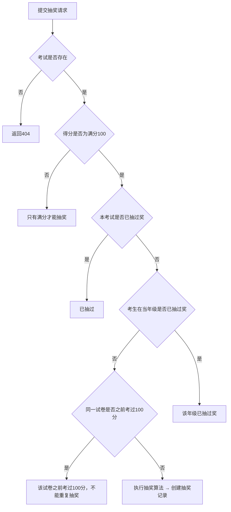

# 小学考试评测系统 - 详细功能文档

> 版本 2.1.0 | Python + FastAPI 后端 + 原生 HTML/CSS/JS 前端（纯显式 SQL）

***

## 一、系统概览

### 1.1 技术架构

| 层级     | 技术                        | 说明                          |
| ------ | ------------------------- | --------------------------- |
| 后端框架   | FastAPI 0.104+            | 异步 Web 框架                   |
| 数据库    | PostgreSQL                | 通过 asyncpg 连接池 + 显式 SQL 直连访问 |
| 数据库驱动  | asyncpg 0.29+             | PostgreSQL 异步驱动，连接池管理         |
| SQL 方式 | 显式 SQL                   | 所有查询使用原生 SQL（`$1/$2` 参数化）    |
| 数据验证   | Pydantic 2.0+             | 请求/响应序列化                    |
| 前端     | 原生 HTML5 + CSS3 + ES6+ JS | 无框架，单页应用                    |
| 服务入口   | `run.py`                  | 启动 uvicorn 服务器              |
| 包管理    | requirements.txt          | Python 依赖                   |

### 1.2 项目文件结构

```
小学考试题/
├── run.py                       # 应用启动入口
├── requirements.txt             # Python 依赖
├── .env.example                 # 环境变量模板
├── .gitignore                   # Git 忽略规则
├── app/                         # 后端核心模块
│   ├── main.py                  # FastAPI 应用入口，中间件注册，路由挂载
│   ├── dependencies.py          # 数据库会话依赖注入
│   ├── config/                  # 配置模块
│   │   ├── settings.py          # 全局配置（数据库/CORS/业务参数）
│   │   ├── database.py          # 数据库连接池 re-export（→ core/database）
│   │   └── logger.py            # 日志配置（按天切割）
│   ├── core/                   # 核心模块
│   │   └── database.py          # asyncpg 连接池管理
│   ├── middleware/              # 中间件
│   │   └── performance.py       # 请求性能监控中间件
│   ├── schemas/                # Pydantic 请求/响应模型
│   ├── services/               # 业务逻辑层（显式 SQL）
│   ├── routers/                # 路由/接口层（9个模块）
│   └── data/                   # 初始化脚本（纯 DDL SQL）
├── static/                     # 前端静态资源
│   ├── index.html              # 单页入口
│   ├── css/style.css           # 全局样式表
│   ├── js/                     # 前端模块化 JavaScript
│   └── images/ & videos/      # 静态素材
└── 题库/                       # 题目导入源文件（.txt）
```

***

## 二、启动与配置

### 2.1 启动入口 `run.py`

```python
uvicorn.run("app.main:app", host="0.0.0.0", port=settings.PORT, reload=开发模式)
```

- 启动 uvicorn ASGI 服务器
- 监听地址 `0.0.0.0`，端口由 `settings.PORT` 控制（默认 3000）
- 开发环境下 `reload=True` 自动热重载

### 2.2 环境变量 `.env.example`

| 变量                   | 默认值                     | 说明               |
| -------------------- | ----------------------- | ---------------- |
| `PORT`               | 3000                    | 服务端口             |
| `NODE_ENV`           | development             | 运行环境             |
| `DB_HOST`            | localhost               | 数据库主机            |
| `DB_PORT`            | 5432                    | 数据库端口            |
| `DB_NAME`            | kaoshiku                | 数据库名             |
| `DB_USER`            | postgres                | 数据库用户            |
| `DB_PASSWORD`        | -                       | 数据库密码            |
| `FRONTEND_URL`       | <http://localhost:8080> | CORS 前端地址        |
| `MAX_FILE_SIZE`      | 10485760 (10MB)         | 上传文件大小限制         |
| `DEFAULT_TIME_LIMIT` | 1800 秒                  | 默认考试时间           |
| `CELEBRATION_SCORE`  | 90 分                    | 庆祝动画触发分数         |

### 2.3 配置类 `app/config/settings.py`

- 基于 `pydantic-settings`，自动从 `.env` 文件加载
- `DATABASE_URL` / `DATABASE_URL_SYNC` 属性：根据 `DB_TYPE` 自动生成不同连接串
- `allowed_origins` 属性：返回 CORS 允许的源列表

***

## 三、`app/main.py` 主应用模块

### 生命周期

```python
@app.on_event("startup")
async def startup():
    # 记录启动日志：环境、数据库连接信息

@app.on_event("shutdown")
async def shutdown():
    # 记录关闭日志
```

### 中间件注册（按顺序）

| 中间件         | 类型                      | 功能                                |
| ----------- | ----------------------- | --------------------------------- |
| CORS        | `CORSMiddleware`        | 跨域允许（GET/POST/PUT/DELETE/OPTIONS） |
| Performance | `PerformanceMiddleware` | 请求耗时监控、慢请求告警（>3s）、500错误日志         |

### 路由注册（9个模块）

| 路由模块            | 前缀                   | 功能   |
| --------------- | -------------------- | ---- |
| `users`         | `/api/users`         | 用户管理 |
| `questions`     | `/api/questions`     | 题目管理 |
| `exams`         | `/api/exams`         | 考试管理 |
| `grades`        | `/api/grades`        | 年级管理 |
| `types`         | `/api/types`         | 题型管理 |
| `papers`        | `/api/papers`        | 试卷管理 |
| `lottery`       | `/api/lottery`       | 抽奖系统 |
| `prizes`        | `/api/prizes`        | 奖项管理 |
| `wrong_answers` | `/api/wrong-answers` | 错题本  |

### 特殊端点

| 路径                  | 方法  | 功能                 |
| ------------------- | --- | ------------------ |
| `/health`           | GET | 健康检查               |
| `/videos/{name}`    | GET | 视频流（支持 Range 断点续传） |
| `/{full_path:path}` | GET | SPA 前端路由 fallback  |

### 视频流实现细节

- 支持 HTTP Range 请求（206 Partial Content）
- 每次读取 64KB 块，支持大视频文件流畅播放
- 无 Range 头时发送完整文件
- `_parse_range()` 辅助函数解析 `Range` 头

***

## 四、数据库设计（10张表）

### 4.1 年级表 `grades`

| 字段      | 类型          | 约束               | 说明                    |
| ------- | ----------- | ---------------- | --------------------- |
| `id`    | int         | PK               | 主键                    |
| `name`  | varchar(20) | UNIQUE, NOT NULL | 年级名称                  |
| `level` | varchar(10) | NOT NULL         | 级别代码: low/middle/high |

**种子数据：**

| id | name       | level  |
| -- | ---------- | ------ |
| 1  | 低年级（1-2年级） | low    |
| 2  | 中年级（3-4年级） | middle |
| 3  | 高年级（5-6年级） | high   |

### 4.2 题型表 `question_types`

| 字段            | 类型           | 约束               | 说明   |
| ------------- | ------------ | ---------------- | ---- |
| `id`          | int          | PK               | 主键   |
| `name`        | varchar(50)  | UNIQUE, NOT NULL | 题型名称 |
| `description` | varchar(200) | nullable         | 题型描述 |

**种子数据：**

| id | name |
| -- | ---- |
| 1  | 选择题  |
| 2  | 填空题  |
| 3  | 判断题  |
| 4  | 计算题  |

### 4.3 用户表 `users`

| 字段               | 类型           | 约束                               | 说明                 |
| ---------------- | ------------ | -------------------------------- | ------------------ |
| `id`             | int          | PK                               | 主键                 |
| `username`       | varchar(100) | UNIQUE, NOT NULL                 | 用户名                |
| `role`           | varchar(20)  | NOT NULL, default='examiner'     | 角色: admin/examiner |
| `allowed_grades` | JSON         | default=\['low','middle','high'] | 允许访问的年级级别          |
| `created_at`     | datetime     | default=now                      | 创建时间               |

**种子用户：**

| username | role     |
| -------- | -------- |
| 张伟       | admin    |
| 张洛琳      | examiner |
| 张洛晗      | examiner |

### 4.4 试卷表 `exam_papers`

| 字段               | 类型           | 约束                              | 说明         |
| ---------------- | ------------ | ------------------------------- | ---------- |
| `id`             | int          | PK                              | 主键         |
| `name`           | varchar(100) | NOT NULL                        | 试卷名称       |
| `grade_id`       | int          | FK→grades.id, ON DELETE CASCADE | 所属年级       |
| `source_file`    | varchar(255) | UNIQUE                          | 来源文件名（去重用） |
| `question_count` | int          | default=0                       | 题目数        |
| `created_at`     | datetime     | default=now                     | 创建时间       |

**要点：**

- `source_file` 唯一，用于判断文件是否已导入（再导入时更新而非重复创建）
- `grade_id` 可为空（通用试卷）

### 4.5 题目表 `questions`

| 字段                | 类型           | 约束                                       | 说明          |
| ----------------- | ------------ | ---------------------------------------- | ----------- |
| `id`              | int          | PK                                       | 主键          |
| `grade_id`        | int          | FK→grades.id, ON DELETE CASCADE          | 所属年级        |
| `type_id`         | int          | FK→question\_types.id, ON DELETE CASCADE | 题型          |
| `content`         | text         | NOT NULL                                 | 题目内容        |
| `options`         | JSON         | nullable                                 | 选项列表（选择题专用） |
| `answer`          | varchar(500) | NOT NULL                                 | 正确答案        |
| `points`          | int          | default=10                               | 分值          |
| `paper_id`        | int          | FK→exam\_papers.id, nullable             | 所属试卷        |
| `reading_content` | text         | nullable                                 | 阅读材料正文（阅读题） |
| `reading_title`   | varchar(200) | nullable                                 | 阅读材料标题      |
| `passage`         | text         | nullable                                 | 预留：短文内容     |
| `created_at`      | datetime     | default=now                              | 创建时间        |

**要点：**

- `options` 存储为 JSON 数组，如 `["A. 选项1", "B. 选项2"]`
- `reading_content` / `reading_title` 为阅读理解题专用，多个题目共享同一阅读材料
- `answer` 答案的比较在后端做了标准化处理（大小写忽略、中文答案映射为字母）

### 4.6 考试记录表 `exam_records`

| 字段                | 类型           | 约束                              | 说明                    |
| ----------------- | ------------ | ------------------------------- | --------------------- |
| `id`              | int          | PK                              | 主键                    |
| `user_name`       | varchar(100) | NOT NULL                        | 考生姓名                  |
| `grade_id`        | int          | FK→grades.id, ON DELETE CASCADE | 考试年级                  |
| `paper_id`        | int          | nullable                        | 考试试卷ID                |
| `total_score`     | int          | default=0                       | 得分（正确率百分比）            |
| `total_questions` | int          | NOT NULL                        | 考试题目总数                |
| `correct_count`   | int          | default=0                       | 正确题数                  |
| `start_time`      | datetime     | default=now                     | 开始时间                  |
| `end_time`        | datetime     | nullable                        | 结束时间                  |
| `status`          | varchar(20)  | default='ongoing'               | 状态: ongoing/completed |

**计分逻辑：**

- `total_score` = 正确率（百分比）= `correct_count / total_questions * 100`
- 满分 = 100（所有题答对）

### 4.7 答题记录表 `answer_records`

| 字段              | 类型           | 约束                                     | 说明   |
| --------------- | ------------ | -------------------------------------- | ---- |
| `id`            | int          | PK                                     | 主键   |
| `exam_id`       | int          | FK→exam\_records.id, ON DELETE CASCADE | 考试ID |
| `question_id`   | int          | FK→questions.id, ON DELETE CASCADE     | 题目ID |
| `user_answer`   | varchar(500) | nullable                               | 用户答案 |
| `is_correct`    | bool         | NOT NULL                               | 是否正确 |
| `points_earned` | int          | NOT NULL                               | 得分   |

### 4.8 错题表 `wrong_answers`

| 字段            | 类型           | 约束                                 | 说明      |
| ------------- | ------------ | ---------------------------------- | ------- |
| `id`          | int          | PK                                 | 主键      |
| `user_name`   | varchar(100) | NOT NULL                           | 用户名     |
| `question_id` | int          | FK→questions.id, ON DELETE CASCADE | 题目ID    |
| `user_answer` | varchar(500) | nullable                           | 用户答错的答案 |
| `exam_id`     | varchar(100) | nullable                           | 考试ID    |
| `created_at`  | datetime     | default=now                        | 创建时间    |

### 4.9 奖项表 `prizes`

| 字段                 | 类型           | 约束            | 说明           |
| ------------------ | ------------ | ------------- | ------------ |
| `id`               | int          | PK            | 主键           |
| `name`             | varchar(100) | NOT NULL      | 奖项名称         |
| `emoji`            | varchar(10)  | nullable      | Emoji 图标     |
| `color`            | varchar(20)  | nullable      | 颜色（16进制）     |
| `base_probability` | numeric(5,2) | default=0     | 基础概率（%）      |
| `is_default`       | bool         | default=False | 是否默认奖项（谢谢惠顾） |
| `updated_at`       | datetime     | nullable      | 更新时间         |

**种子奖项：**

| name     | emoji | base\_probability | is\_default |
| -------- | ----- | ----------------- | ----------- |
| 2元钱      | 💰    | 14.29             | ❌           |
| 1元钱      | 💵    | 14.29             | ❌           |
| 游乐场一次    | 🎡    | 14.29             | ❌           |
| 火锅一次     | 🍲    | 14.29             | ❌           |
| 一个西瓜     | 🍉    | 14.29             | ❌           |
| 看爸爸手机0分钟 | 📱    | 14.29             | ❌           |
| 谢谢惠顾     | 🎁    | 14.25             | ✅           |

### 4.10 抽奖记录表 `lottery_records`

| 字段            | 类型           | 约束                                     | 说明      |
| ------------- | ------------ | -------------------------------------- | ------- |
| `id`          | int          | PK                                     | 主键      |
| `exam_id`     | int          | FK→exam\_records.id, ON DELETE CASCADE | 关联的考试ID |
| `user_name`   | varchar(100) | NOT NULL                               | 抽奖用户    |
| `prize_name`  | varchar(100) | NOT NULL                               | 奖项名称    |
| `prize_emoji` | varchar(10)  | nullable                               | 奖项Emoji |
| `is_redeemed` | bool         | default=False                          | 是否已兑现   |
| `redeemed_at` | datetime     | nullable                               | 兑现时间    |
| `created_at`  | datetime     | default=now                            | 抽奖时间    |

***

## 五、业务逻辑层（Services）详解

### 5.1 用户服务 `user_service.py`

| 函数                   | 参数                       | 返回值         | 功能                 |
| -------------------- | ------------------------ | ----------- | ------------------ |
| `find_by_username`   | db, username             | User\|None  | 按用户名查询用户           |
| `create_user`        | db, UserCreate           | User        | 创建用户，默认角色 examiner |
| `get_all_users`      | db                       | list\[User] | 获取所有用户（按创建时间倒序）    |
| `update_user`        | db, user\_id, UserUpdate | User\|None  | 更新用户角色/允许年级        |
| `delete_user`        | db, user\_id             | User\|None  | 删除用户               |
| `is_admin`           | db, username             | bool        | 判断是否管理员            |
| `get_allowed_grades` | db, username             | list\[str]  | 获取用户允许访问的年级        |

### 5.2 题目服务 `question_service.py`

| 函数                    | 参数                                                  | 返回值            | 功能                                                                                                                                |
| --------------------- | --------------------------------------------------- | -------------- | --------------------------------------------------------------------------------------------------------------------------------- |
| `find_all`            | db, filters={}                                      | list\[dict]    | **原生SQL多表联查**，支持按 grade\_id/type\_id/type\_ids/paper\_id 过滤，支持 limit/offset 分页，LEFT JOIN grades/question\_types/exam\_papers 获取名称 |
| `find_by_id`          | db, question\_id                                    | dict\|None     | 单题查询（联查年级/题型名）                                                                                                                    |
| `create_question`     | db, QuestionCreate                                  | Question       | 创建题目                                                                                                                              |
| `update_question`     | db, question\_id, QuestionUpdate                    | Question\|None | 更新题目（部分字段）                                                                                                                        |
| `delete_question`     | db, question\_id                                    | Question\|None | 删除题目                                                                                                                              |
| `count_questions`     | db, grade\_id, type\_id                             | int            | 统计题目数（原生SQL）                                                                                                                      |
| `import_from_file`    | db, file\_path, grade\_id, type\_id, original\_name | dict           | 从文件导入题目                                                                                                                           |
| `scan_question_bank`  | db                                                  | dict           | 扫描题库文件夹批量导入                                                                                                                       |
| `clear_question_bank` | db                                                  | -              | 清空所有题目+答题记录+考试记录                                                                                                                  |
| `reset_and_rescan`    | db                                                  | dict           | 清空后重扫（组合调用）                                                                                                                       |

**`import_from_file`** **流程详解：**

1. 读取文件内容（UTF-8）
2. 调用 `parser_service.parse()` 解析题目
3. 以 `source_file` 检查是否已存在试卷 → 已存在则删除旧题目后更新，不存在则创建新试卷
4. 逐题插入数据库
5. 更新试卷题目计数
6. 返回成功/失败统计和明细列表

**`scan_question_bank`** **流程详解：**

1. 读取 `题库/` 目录下所有 `.txt` 文件
2. 逐个文件解析 → 逐个创建试卷 → 逐个插入题目
3. 通过 `_detect_grade_from_content()` 根据内容关键词自动推断年级
4. 文件名为试卷名

**`clear_question_bank`** **删除顺序：** answer\_records → exam\_records → questions → 重置试卷计数

### 5.3 考试服务 `exam_service.py`

#### 核心流程

```
start_exam → render questions → [逐个答题] → submit_all_answers → show_result → [满分则触发庆祝+抽奖]
```

#### 各函数详解

| 函数                            | 功能                                        |
| ----------------------------- | ----------------------------------------- |
| `start_exam`                  | 按年级+试卷+题型过滤查询题目，创建 ExamRecord，返回考试信息+题目列表 |
| `get_exam_status`             | 获取考试当前状态（已答数量、详情）                         |
| `submit_answer`               | 提交单个题目答案，判断正误，创建 AnswerRecord             |
| `submit_all_answers`          | 批量提交答案，统计正确数，记录错题到 wrong\_answers，完成考试    |
| `complete_exam`               | 手动触发完成考试（如果状态还不是 completed）               |
| `check_paper_already_perfect` | 检查用户是否在该试卷已考过 100 分（用于防止重复抽奖）             |
| `get_exam_history`            | 获取某用户考试历史                                 |
| `get_all_exam_history`        | 获取所有 completed 考试记录                       |
| `get_exam_details`            | 获取考试详情（按题型分组展示答题情况）                       |

**内部辅助函数：**

| 函数                         | 说明                     |
| -------------------------- | ---------------------- |
| `_find_exam_by_id`         | 按ID查考试（联查年级名）          |
| `_find_answers_by_exam_id` | 按考试ID查所有答题记录（联查题目）     |
| `_complete_exam`           | 原生SQL更新考试状态为 completed |

#### 答案判断逻辑 `submit_answer`

```
1. 获取题目的正确答案，转大写去空格
2. 判断正确答案类型：
   - "正确"/"错误" → 映射为 "A"/"B"（判断题）
   - 单字母 A-D → 直接比较（选择题）
   - 其他 → 直接字符串比较（填空题/计算题）
3. 创建 AnswerRecord 记录
```

#### 抽奖控制逻辑（`submit_all_answers`）

```
满分 100 → 检查是否该试卷已考过满分
  ├─ 已考过 → can_lottery=False，提示"该试卷之前已考过100分"
  └─ 未考过 → can_lottery=True，触发庆祝动画
非满分 → 始终不能抽奖
```

### 5.4 题目解析服务 `parser_service.py`

题目解析服务是整个题库管理系统的核心，负责将原始文本内容自动解析为结构化的题目数据。支持三种解析策略和四种题型。

#### 5.4.1 题型总览

| 题型ID | 题型名称 | 选项字段 | 答案示例 | 典型特征 |
| ------ | -------- | -------- | -------- | -------- |
| 1 | 选择题 | 必填（A/B/C/D列表） | `B` | 包含选项 A. B. C. D. |
| 2 | 填空题 | 无 | `12` / `地球` | 含 `____` 或 `（）` |
| 3 | 判断题 | 无 | `A`（正确）/ `B`（错误） | 内容含"正确/错误" |
| 7 | 计算题 | 无 | `42` / `3.14` | 含 `=` 表达式 |

> **注意**：结构化解析中题型映射为 `{"选择题": 1, "填空题": 2, "判断题": 3, "计算题": 7}`。数据库 seed 数据中计算题为 ID=4，但解析器输出为 ID=7，使用时需注意一致性。

#### 5.4.2 解析入口 `parse(content, grade_id, type_id)`

按优先级依次尝试三种策略：

| 优先级 | 策略 | 触发条件 | 方法 |
| ------ | ---- | -------- | ---- |
| 1 | 结构化格式 | 内容含 `=== 题目开始 ===` | `_parse_structured()` |
| 2 | 阅读理解 | 内容含 10+ 连续下划线 + "阅读"关键词 + "选择题" | `_parse_reading()` |
| 3 | 自然格式 | 以上都不满足 | `_parse_natural()` |

返回统一的数据结构 `list[QuestionCreate]`，字段为 `{grade_id, type_id, content, options, answer, points, paper_id?, reading_content?, reading_title?}`。

---

#### 5.4.3 结构化格式解析 `_parse_structured()`

每道题目由 `=== 题目开始 ===` 和 `=== 题目结束 ===` 包裹，内部用字段标签标识。

##### 通用模板

```
=== 题目开始 ===
年级：{年级名称}
题型：{题型名称}
分值：{整数}
题目：{题干内容}
选项：              ← 填空题/判断题/计算题可省略此段
A. {选项A内容}
B. {选项B内容}
C. {选项C内容}
D. {选项D内容}
正确答案：{答案}
=== 题目结束 ===
```

##### 各题型示例

**选择题模板：**

```
=== 题目开始 ===
年级：低年级
题型：选择题
分值：20
题目：太阳从哪个方向升起？
选项：
A. 东方
B. 西方
C. 南方
D. 北方
正确答案：A
=== 题目结束 ===
```

**填空题模板：**

```
=== 题目开始 ===
年级：中年级
题型：填空题
分值：10
题目：中国的首都是____。
正确答案：北京
=== 题目结束 ===
```

**判断题模板：**

```
=== 题目开始 ===
年级：中年级
题型：判断题
分值：10
题目：地球绕着太阳转。
正确答案：正确
=== 题目结束 ===
```

**计算题模板：**

```
=== 题目开始 ===
年级：高年级
题型：计算题
分值：15
题目：25 × 4 = ?
正确答案：100
=== 题目结束 ===
```

##### 字段标签解析规则

| 字段标签 | 正则匹配 | 备注 |
| -------- | -------- | ---- |
| `年级：xxx` | `年级[：:]\\s*(.+)` | 仅在外部未指定 `grade_id` 时生效 |
| `题型：xxx` | `题型[：:]\\s*(.+)` | 仅在外部未指定 `type_id` 时生效 |
| `分值：N` | `分值[：:]\\s*(\\d+)` | 提取整数，默认为 10 |
| `题目：xxx` | `题目[：:]\\s*(.+?)(?=\\n(?:选项\|正确答案\|题型\|年级\|分值\|题目编号)\|$)` | 多行匹配到下一标签 |
| `选项：\\n...` | `选项[：:]\\s*\\n(.+?)(?=\\n正确答案\|\\n题型\|\\n题目编号\|$)` | 按行拆分，每行一个选项 |
| `正确答案：xxx` | `正确答案[：:]\\s*(.+)` | 原始文本保留 |

---

#### 5.4.4 自然格式解析 `_parse_natural()`

适用于从 Word/PDF 复制过来的试卷内容，无需特殊标记，按行逐条解析。以下按题型分别说明识别规则和模板。

##### 4.1 选择题

**识别规则：**
1. 小节标题含 "选择" → 优先判定为选择题（type_id=1）
2. 题目文本中匹配到 `A.xxx B.xxx` 选项模式 → 判定为选择题
3. 选项可跨行：独立行 `A. xxx` 或同行 `A.xxx B.xxx C.xxx D.xxx` 均支持

**模板（选项跨行）：**

```
一、选择题（每题10分）

1. 下列哪个是哺乳动物？
A. 鲨鱼
B. 鲸鱼
C. 章鱼
D. 金鱼
答案：B

2. 水的化学式是什么？
A. CO₂
B. H₂O
C. NaCl
D. O₂
答案：B
```

**模板（选项同行）：**

```
一、选择题（每题10分）

1. 1+1等于几？A. 1 B. 2 C. 3 D. 4
答案：B

2. 最大的两位数是多少？A. 99 B. 100 C. 90 D. 89
答案：A
```

**选项行内多选项拆分逻辑**：当一行的选项在同一行（如 `A. 1 B. 2 C. 3 D. 4`），先用 `re.finditer(r'([A-Da-d])\\s*[.、．:：]', line)` 找出每个选项的起始位置，再按位置切割，保证每个选项独立。

##### 4.2 填空题

**识别规则：**
1. 小节标题含 "填空" / "填一填" → 判定为填空题（type_id=2）
2. 题目中包含 `____` / `＿＿` / `___` 下划线 → 判定为填空题
3. 题目中包含 `（  ）` / `（）` / `(  )` / `()` 空括号 → 判定为填空题
4. 答案以内联形式写在括号中，如 `中国的首都是（北京）` → 提取答案"北京"，题干变为 `中国的首都是（  ）`

**模板（下划线式）：**

```
二、填空题（每题10分）

1. 一年有____个月。
答案：12

2. 中华人民共和国的首都是____。
答案：北京
```

**模板（内联答案式）：**

```
二、填空题

1. 一年有（12）个月。
2. 中国的国旗是（五星红旗）。
3. 一周有（7）天。
```

内联答案提取正则：`re.search(r'[（(]\\s*([^）)]+?)\\s*[）)]\\s*$', question_text)`

##### 4.3 判断题

**识别规则：**
- 小节标题含 "判断" → 判定为判断题（type_id=3）
- 判断题无独立识别特征，完全依赖小节标题判定

**模板：**

```
三、判断题（每题10分）

1. 一年有13个月。（  ）
答案：错误

2. 太阳从东方升起。（  ）
答案：正确

3. 鲸鱼是鱼类。（  ）
答案：错误
```

判断题答案在后续答题判断环节会做特殊处理：`"正确" → "A"`，`"错误" → "B"`（详见 5.3 节）。

##### 4.4 计算题

**识别规则：**
1. 小节标题含 "计算" / "口算" / "写得数" / "竖式" / "脱式" / "直接" → 判定为计算题（type_id=7）
2. 题目匹配 `=\\s*(\\S+)` → 提取等号后面的答案，并将答案部分替换为 `= ______`

**模板：**

```
四、计算题（每题20分）

1. 25 × 4 = 100
2. 3.14 × 2 = 6.28
3. 1/2 + 1/3 = 5/6
```

解析后题目变为：
- `25 × 4 = ______`，答案 `100`
- `3.14 × 2 = ______`，答案 `6.28`
- `1/2 + 1/3 = ______`，答案 `5/6`

**答案隐藏逻辑**：`re.sub(r'\\s*=\\s*\\S+$', ' = ______', question_text)` — 将等号后的数字替换为空白，避免答案暴露在题干中。

##### 4.5 小节标题识别

小节标题格式 `一、xxx` / `二.xxx` / `三．xxx`（支持 `、` `.` `．` 三种分隔符）：

| 标题关键词 | 自动设置题型 | 
| ---------- | ------------ |
| 计算 / 口算 / 写得数 / 竖式 / 脱式 / 直接 | 计算题 (7) |
| 选择 | 选择题 (1) |
| 判断 | 判断题 (3) |
| 填空 / 填一填 | 填空题 (2) |

小节标题中的分值也会被提取，如 `一、选择题（每题10分）` → `re.search(r'每题(\\d+)分', section_title)` 提取分值。

##### 4.6 追加行逻辑

当某行不属于上述任何匹配（非标题、非编号、非选项、非答案行），且当前题目尚未收集到选项和答案时，将该行内容追加到当前题目文本中（用空格拼接）。这用于处理跨行的长题干。

---

#### 5.4.5 阅读理解解析 `_parse_reading()`

##### 触发条件 `_is_reading_comprehension()`

三个条件同时满足：
1. 内容中存在 10 个以上连续下划线（`_{10,}`），通常用作分隔线
2. 内容中包含"阅读"关键词，且同时包含"短文"/"回答问题"/"阅读理解"之一
3. 内容中包含"选择题"

##### 整体结构模板

```
阅读短文，回答问题。

____________________________

秋天来了

　　秋天来了，天气凉了。一片片黄叶从树上落下来。

　　一群大雁往南飞，一会儿排成个"人"字，一会儿排成个"一"字。

____________________________

选择题（每题20分）

1. 什么季节来了？
A. 春天
B. 夏天
C. 秋天
D. 冬天
答案：C

2. 大雁往哪个方向飞？
A. 东方
B. 西方
C. 南方
D. 北方
答案：C
```

##### 解析流程

```
1. 定位两条 ____________ 分隔线
2. 提取两条分隔线之间的阅读材料正文
   ├─ 标题识别：首行短文本且无标点 → reading_title
   └─ 正文：全部段落文本 → reading_content
3. 从"选择题"关键字之后开始解析题目
   ├─ 题目编号：数字. 题干
   ├─ 选项行：A. xxx / B. xxx
   ├─ 答案行：答案：xxx
   └─ 每道题解析完成后，附加 reading_content 和 reading_title
```

##### 输出数据特点

每道解析出的题目除了常规字段外，额外携带：
- `reading_content`：完整的阅读材料正文（所有题目共享同一份）
- `reading_title`：阅读材料的标题（自动识别短文首行）

前端渲染时采用**双栏布局**：左侧 sticky 面板展示阅读材料，右侧滚动展示题目列表（参见 7.7 节）。

---

#### 5.4.6 答案清洗 `_clean_answer()`

对原始答案文本做标准化处理：

```
原始文本 → 去除首尾空白
         → 按 （ 或 ( 分割，取括号前部分（去除注释性括号内容）
         → 如果括号前为空，尝试提取 [A-Da-d] 字母并转大写
         → 返回清洗后的答案字符串
```

示例：

| 原始答案 | 清洗结果 |
| -------- | -------- |
| `B` | `B` |
| `B（正确答案）` | `B` |
| `正确（√）` | `正确` |
| `  b  ` | `B` |

---

#### 5.4.7 年级推断 `_detect_grade_id()`

根据内容关键词自动推断学段（仅在未指定 `grade_id` 时生效）：

| 关键词 | 映射年级 | 对应学段 |
| ------ | -------- | -------- |
| 幼儿园 / 幼升小 / 低年级 | 1 | 低年级（1-2年级） |
| 三年级 / 中年级 | 2 | 中年级（3-4年级） |
| 高年级 / 五年级 / 六年级 | 3 | 高年级（5-6年级） |
| 默认（无关键词匹配） | 2 | 中年级 |

---

#### 5.4.8 解析流程总图

```
parse(content, grade_id, type_id)
│
├─ 含 "=== 题目开始 ===" ? 
│   └─ YES → _parse_structured()
│       └─ 按 === 题目开始 / 题目结束 === 切分块
│           └─ 每块正则提取：年级/题型/分值/题目/选项/正确答案
│
├─ 含 10+连续下划线 + "阅读" + "选择题" ?
│   └─ YES → _parse_reading()
│       └─ 提取分隔线间的阅读材料
│       └─ 从"选择题"后逐行解析题目（复用自然格式逻辑）
│       └─ 每道题附加 reading_content / reading_title
│
└─ 其他 → _parse_natural()
    └─ 逐行遍历
        ├─ 识别小节标题 → 设置题型/分值
        ├─ 识别题目编号 → 提交上题，开始新题
        │   ├─ 内联答案提取（括号内）
        │   ├─ 选项提取（同行或跨行）
        │   └─ 题型自动推断（下划线→填空, 选项→选择, 括号→填空, =→计算）
        ├─ 识别选项行 → 追加选项
        ├─ 识别答案行 → 设置答案
        └─ 其他行 → 追加到题干（跨行拼接）
```

### 5.5 抽奖服务 `lottery_service.py`

| 函数                     | 功能                       |
| ---------------------- | ------------------------ |
| `create_record`        | 创建抽奖记录                   |
| `find_by_user`         | 按用户查抽奖记录（联查考试、年级信息）      |
| `find_by_exam`         | 按考试ID查抽奖记录               |
| `find_all`             | 获取所有抽奖记录                 |
| `find_by_id`           | 按ID查记录                   |
| `update_redeem_status` | 更新兑现状态（同时更新兑现时间）         |
| `check_can_draw`       | 检查用户是否可在某年级抽奖（每个年级只能抽一次） |

### 5.6 奖项服务 `prize_service.py`

#### 动态概率算法 `calculate_dynamic_probabilities(db, question_count)`

```
1. 获取所有奖项
2. 如果题目数 < 10，给默认奖项加成：(10 - 题目数) * 5%，上限 30%
3. 计算非默认奖项概率总和
4. 剩余概率 = 100 - 非默认奖项概率总和 → 分配给默认奖项
```

**关键逻辑：题目越少，"谢谢惠顾"概率越高（鼓励多做题目）**

#### 抽奖函数 `draw(db, question_count)`

```
1. 计算动态概率
2. 生成 [0, 100) 随机数
3. 按累计概率区间命中对应奖项
4. 返回奖项信息
```

### 5.7 试卷服务 `paper_service.py`

| 函数                    | 功能                              |
| --------------------- | ------------------------------- |
| `get_all_papers`      | 获取所有试卷，支持传 user\_name 计算该用户完成情况 |
| `find_by_id`          | 按ID查试卷                          |
| `find_by_source_file` | 按源文件名查试卷（去重）                    |
| `create_paper`        | 创建试卷                            |
| `update_paper_count`  | 更新试卷题目计数                        |

**`get_all_papers`** **返回的额外字段：**

- `done_count`：用户在该试卷已完成且正确的题数
- `remaining_count`：剩余未做/未正确的题数

### 5.8 错题服务 `wrong_answer_service.py`

| 函数                       | 功能                                      |
| ------------------------ | --------------------------------------- |
| `get_wrong_answers`      | 分页获取指定用户的错题（联查题目、题型信息）                  |
| `get_wrong_answer_count` | 获取用户错题总数                                |
| `delete_wrong_answer`    | 删除单条错题记录                                |
| `clear_wrong_answers`    | 清空用户的全部错题                               |
| `get_practice_questions` | 按题目ID列表获取练习题目（随机排序 `ORDER BY RANDOM()`） |

***

## 六、API 路由接口一览

### 6.1 用户接口 `/api/users`

| 方法     | 路径            | 功能     | 关键逻辑           |
| ------ | ------------- | ------ | -------------- |
| POST   | `/login`      | 登录     | 存在则返回，不存在则自动注册 |
| POST   | \`\`          | 注册     | 检查用户名不重复，201   |
| GET    | \`\`          | 获取所有用户 | -              |
| GET    | `/{username}` | 获取单个用户 | -              |
| PUT    | `/{user_id}`  | 更新用户   | -              |
| DELETE | `/{user_id}`  | 删除用户   | -              |

### 6.2 题目接口 `/api/questions`

| 方法     | 路径           | 功能     | 关键逻辑                                    |
| ------ | ------------ | ------ | --------------------------------------- |
| GET    | \`\`         | 分页查询题目 | 支持 grade\_id/type\_id 过滤                |
| GET    | `/{id}`      | 获取单个题目 | 联查年级/题型名                                |
| POST   | \`\`         | 创建题目   | 校验 grade\_id/type\_id/content/answer 必填 |
| PUT    | `/{id}`      | 更新题目   | 部分字段更新                                  |
| DELETE | `/{id}`      | 删除题目   | -                                       |
| POST   | `/import`    | 导入题目文件 | FormData 上传，保存到题库目录                     |
| POST   | `/scan-bank` | 扫描题库   | 自动扫描 `题库/` 目录                           |
| POST   | `/clear`     | 清空题库   | 清除所有题目+相关记录                             |
| POST   | `/reset`     | 重置重扫   | = clear + scan-bank                     |

### 6.3 考试接口 `/api/exams`

| 方法   | 路径                      | 功能       | 关键逻辑              |
| ---- | ----------------------- | -------- | ----------------- |
| POST | `/start`                | 开始考试     | 创建考试记录，返回题目列表     |
| GET  | `/{exam_id}`            | 获取考试状态   | 返回考试信息+已答数量       |
| GET  | `/{exam_id}/result`     | 获取考试结果   | 触发 complete\_exam |
| POST | `/{exam_id}/submit`     | 提交单个答案   | 创建答题记录            |
| POST | `/{exam_id}/submit-all` | 提交全部答案   | 批量提交+完成考试+返回结果    |
| GET  | `/{exam_id}/details`    | 获取考试详情   | 按题型分组展示           |
| GET  | `/history`              | 用户考试历史   | 传 user\_name 查询   |
| GET  | `/history/all`          | 全部考试历史   | 管理员查看所有，普通用户只看自己  |
| GET  | `/check-paper-perfect`  | 检查试卷满分记录 | 用于防止重复抽奖          |

### 6.4 抽奖接口 `/api/lottery`

| 方法   | 路径             | 功能       | 关键逻辑                            |
| ---- | -------------- | -------- | ------------------------------- |
| GET  | `/prizes`      | 获取抽奖奖项列表 | 用于转盘渲染                          |
| POST | `/draw`        | 正式抽奖     | 校验满分→校验无重复→校验按年级→校验不同试卷→抽奖→创建记录 |
| POST | `/demo`        | 演示抽奖     | 仅管理员"张伟"可用                      |
| GET  | `/records`     | 用户抽奖记录   | -                               |
| GET  | `/records/all` | 全部抽奖记录   | -                               |
| PUT  | `/redeem`      | 更新兑现状态   | -                               |

**Mermaid 流程图（抽奖校验链）：**



### 6.5 奖项管理 `/api/prizes`

| 方法     | 路径         | 功能          | 关键逻辑                       |
| ------ | ---------- | ----------- | -------------------------- |
| GET    | \`\`       | 获取所有奖项+概率总和 | -                          |
| GET    | `/{id}`    | 获取单个奖项      | -                          |
| POST   | \`\`       | 创建奖项        | 校验概率0-100, 校验总和不超过100%     |
| PUT    | `/{id}`    | 更新奖项        | 同上校验                       |
| DELETE | `/{id}`    | 删除奖项        | 不可删除默认奖项 `is_default=True` |
| GET    | `/dynamic` | 动态概率预览      | 参数 question\_count         |

### 6.6 错题本接口 `/api/wrong-answers`

| 方法     | 路径                        | 功能                   |
| ------ | ------------------------- | -------------------- |
| GET    | `/user/{user_name}`       | 获取用户错题（分页）           |
| GET    | `/user/{user_name}/count` | 获取错题总数               |
| DELETE | `/{answer_id}`            | 删除单条错题               |
| DELETE | `/user/{user_name}`       | 清空该用户所有错题            |
| POST   | `/practice`               | 错题练习（按ID列表获取题目，随机排序） |

***

## 七、中间件 `PerformanceMiddleware`

### 功能

对每个 HTTP 请求记录以下指标：

| 监控项           | 条件                   | 日志级别    |
| ------------- | -------------------- | ------- |
| 响应耗时 > 500ms  | `duration > 500`     | INFO    |
| 响应耗时 > 3000ms | `duration > 3000`    | WARNING |
| 状态码 >= 500    | `status_code >= 500` | ERROR   |

记录字段：

```json
{
  "method": "GET",
  "path": "/api/exams/history",
  "statusCode": 200,
  "duration": 245   // 毫秒
}
```

***

## 八、日志配置 `app/config/logger.py`

### 处理器

| Handler          | 文件                  | 切割策略 | 保留  | 级别                  |
| ---------------- | ------------------- | ---- | --- | ------------------- |
| Error Handler    | `logs/error.log`    | 每天午夜 | 14天 | ERROR               |
| Combined Handler | `logs/combined.log` | 每天午夜 | 30天 | INFO                |
| Console Handler  | stdout              | -    | -   | DEV=DEBUG, PRO=INFO |

- Logger 名: `exam_system`
- propagate=False（不向父级传播）
- 格式: `日期 时间 [级别] exam_system: 日志内容`

***

## 九、前端架构

### 9.1 单页路由（Page Shown / Hidden）

| 页面 ID                  | 用途        | 导航方式                                |
| ---------------------- | --------- | ----------------------------------- |
| `page-welcome`         | 登录/欢迎     | `navigateTo('welcome')`             |
| `page-home`            | 年级选择      | `navigateTo('home')`                |
| `page-papers`          | 试卷选择      | `navigateTo('papers')`（触发 grade 跳转） |
| `page-exam`            | 普通考试      | `startExam` + `navigateTo('exam')`  |
| `page-reading-exam`    | 阅读理解考试    | 检测到 reading\_content 自动跳转           |
| `page-result`          | 考试结果      | `navigateTo('result')`              |
| `page-history`         | 成绩查询      | `navigateTo('history')`             |
| `page-lottery-history` | 中奖记录      | `navigateTo('lottery-history')`     |
| `page-manage`          | 题库管理      | `navigateTo('manage')`              |
| `page-redeem-manage`   | 兑现管理+奖项管理 | `navigateTo('redeem-manage')`       |
| `page-wrong-answers`   | 错题本       | `navigateTo('wrong-answers')`       |
| `page-users`           | 用户管理      | `navigateTo('users')`               |

导航函数 `navigateTo(page)` ：

1. 隐藏所有 `.page`
2. 显示指定 `.page`
3. 根据目标页面加载对应数据
4. 权限校验（admin-only 页面被拦截时自动跳回 home）

### 9.2 JS 模块划分

| 文件                 | 职责      | 核心变量/函数                                                                                                                                                                   |
| ------------------ | ------- | ------------------------------------------------------------------------------------------------------------------------------------------------------------------------- |
| `state.js`         | 全局状态    | `state` 对象、`photoMap`、`setState`、`resetExamState`                                                                                                                         |
| `api.js`           | API 封装  | `api.*` 所有后端接口调用方法                                                                                                                                                        |
| `utils.js`         | 工具+渲染函数 | `showToast`、`formatDate`、`formatTime`、`navigateTo`、`renderGradeCardsNav`、`loadAllHistory`、`loadRedeemRecords`、`loadUsers`、`loadWrongAnswersForNav`、`loadManageDataForNav` |
| `main.js`          | 主逻辑     | `searchHistory`、`showExamDetails`、用户管理 CURD、`toggleRedeem`                                                                                                                |
| `exam.js`          | 考试核心    | `startExam`、`renderQuestion`、`submitAnswer`、`submitExam`、`showResult`、庆祝动画系统                                                                                              |
| `welcome.js`       | 欢迎/登录   | `submitName`、`login`、年级选择、试卷渲染                                                                                                                                            |
| `lottery.js`       | 抽奖系统    | `showLottery`、`spinWheel`、`loadLotteryWheel`、转盘动画                                                                                                                         |
| `manage.js`        | 题库管理    | `loadQuestions`、`uploadFile`、`scanQuestionBank`、`switchTab`、奖项管理                                                                                                          |
| `wrong-answers.js` | 错题本     | `loadWrongAnswers`、`deleteWrongAnswer`、`clearAllWrongAnswers`、`practiceWrongAnswers`                                                                                      |
| `reading-exam.js`  | 阅读理解考试  | `startReadingExam`、`renderReadingQuestions`、双栏布局                                                                                                                          |

### 9.3 全局状态 `state.js`

```javascript
const state = {
  grades: [],           // 年级列表
  types: [],            // 题型列表
  exam: null,           // 当前考试对象 { id, grade_id, user_name, total_questions }
  questions: [],        // 当前考试题目列表（后端返回 含 type_name/grade_name/paper_name）
  currentIndex: 0,      // 当前题目索引
  answers: {},          // { questionId: userAnswer }
  timerInterval: null,  // 计时器句柄
  timeLeft: 1800,       // 剩余时间（秒），默认30分钟
  submitted: {},        // { questionId: { answer: ... } } 已提交标记
  userName: '',         // 当前用户名
  lastExamRecord: null, // 最近一次考试记录
  userRole: 'examiner', // 当前用户角色
  allowedGrades: ['low', 'middle', 'high'] // 允许访问的年级
};
```

### 9.4 考试核心流程（exam.js + reading-exam.js）

```
[选择试卷] → startExam → 后端返回考试ID+题目列表 → 设置 state
    ↓
检测是否有 reading_content → 有 → startReadingExam（双栏模式）
    ↓ 否
navigateTo('exam') → renderQuestion() → 计时开始
    ↓
[逐题作答] → selectOption / fillAnswer → submitAnswer() → 记录
    ↓
全部题目答完 → showConfirmDialog() → submitExam() → 批量提交答案
    ↓
showResult() → 满分可触发庆祝动画
```

#### 计时逻辑

- 选择题/填空题/判断题：每题 120 秒（2分钟）
- 阅读理解题：每题 40 秒（因为需要同时看阅读材料）
- 剩余 ≤ 300 秒（5分钟）：计时器变红闪烁
- 时间到：自动提交

#### 键盘快捷键（`addKeyboardListeners`）

| 按键         | 操作             |
| ---------- | -------------- |
| Enter      | 提交当前题答案        |
| ArrowRight | 下一题            |
| ArrowLeft  | 上一题            |
| A/B/C/D    | 选择对应选项（选择/判断题） |

### 9.5 庆祝动画系统 `showCelebration(score)`

```
1. 覆盖层全屏幕展示分数
2. 播放用户专属视频（videoMap: 张洛晗→.mp4, 张洛琳→.mp4）
   - 视频缺失 → Canvas 粒子动画降级
3. Canvas 粒子特效（80个彩色粒子随机运动）
4. Emoji 飘落特效（30个随机emoji从上方飘落）
5. 5秒后显示"点击抽奖"按钮
6. 30秒后自动关闭
7. 点击覆盖层也可关闭
```

### 9.6 抽奖转盘动画（lottery.js）

```
spinWheel() → api.drawLottery() → 获得抽奖结果
  → 计算目标角度 → wheel.style.transform 旋转 5*360 + 偏移角
  → CSS transition 4s 缓动 → setTimeout 显示结果
```

### 9.7 错题练习

```
practiceWrongAnswers() → 
  1. 获取所有错题ID
  2. api.practiceWrongAnswers(userName, questionIds)
  3. 后端返回随机排序的题目（ORDER BY RANDOM()）
  4. 按每题40秒 → 启动考试模式
```

***

## 十、前端细节

### 10.1 Toast 通知 `showToast(msg, type, duration)`

| 类型             | 渐变                  | 位置   |
| -------------- | ------------------- | ---- |
| success        | `#10b981 → #059669` | 底部居中 |
| error          | `#ef4444 → #f87171` | 底部居中 |
| info           | `#6366f1 → #4f46e5` | 底部居中 |
| warning-center | `#dc2626 → #b91c1c` | 屏幕中央 |

warning-center 专用于"该试卷之前已考过100分"等重量级提示。

### 10.2 背景系统 `changeBackground()`

- 默认：渐变背景（紫色系 `→ #667eea → #764ba2`）
- 点击🎨按钮：从 `static/images/backgrounds/` 随机选择 webp 图片作为背景
- 切换时 1s transition

### 10.3 角色权限

| 功能   | examiner（考生）                | admin（管理员-张伟）                  |
| ---- | --------------------------- | ------------------------------ |
| 用户管理 | ❌                           | ✅                              |
| 题库管理 | ❌（除张伟）                      | ✅                              |
| 兑现管理 | ❌                           | ✅                              |
| 奖项管理 | ❌                           | ✅                              |
| 演示抽奖 | ❌                           | ✅（POST /demo 校验 username="张伟"） |
| 考试   | ✅（按 allowed\_grades 限制可见年级） | ✅（所有年级）                        |

### 10.4 API 封装 `api.js`

```javascript
async function request(method, path, data, isFile) {
  // 1. 构造 fetch 请求
  // 2. 非文件请求 → Content-Type: application/json
  // 3. 文件请求 → FormData body
  // 4. 解析 JSON 响应
  // 5. code != 200 && code != 201 → throw Error
  // 6. 返回 json.data
}
```

- 所有 `api.*` 方法返回 `.data`
- 错误通过异常抛出

***

## 十一、注意事项 & 边界处理

### 11.1 数据库相关

1. **清空题库顺序**：先删 `answer_records` → 再删 `exam_records` → 再删 `questions` → 重置 `exam_papers.question_count`，避免外键约束冲突。
2. **试卷去重**：`source_file` 为 UNIQUE 约束，同名文件再导入不走创建流程，走更新流程（删旧题目、新增题目）。

### 11.2 考试相关

1. **不重复抽奖规则（三层控制）**：
   - 同一考试只能抽一次（`find_by_exam` 已存在即拒绝）
   - 同一年级只能抽一次（`check_can_draw` 按 grade\_id 判断）
   - 同一试卷之前考过 100 分不能再次抽奖（`check_paper_already_perfect`）
2. **分数计算**：得分 = 正确率百分比，满分 = 100（所有题答对）。每题分值 `points` 目前只在展示层面使用，实际计分是二元的（对/错）。
3. **答案匹配**：后端做了标准化处理——大小写忽略、中文"正确"→A、"错误"→B、单字母直接对比、其他纯字符串对比。

### 11.3 题目导入/解析

1. **三种格式自动识别**：结构化 `=== 题目开始 ===` → 阅读理解 `____+阅读+选择题` → 自然格式。
2. **年级自动推断**：由上到下依次判断关键词"幼儿园"→低年级、"三年级"→中年级、"高年级/五年级/六年级"→高年级、默认→中年级。
3. **答案清洗**：`_clean_answer()` 移除括号注释如 `A（选项说明）`→`A`。

### 11.4 前端相关

1. **未登录拦截**：`navigateTo` 中如果 !userName 且目标不是 welcome → 强制跳回 welcome。
2. **阅卷语言理解**：双栏布局（左栏阅读材料可折叠 sticky，右栏答题卡滚动），每题40秒时限。
3. **视频播放降级**：用户视频加载失败时自动降级为 Canvas 粒子动画。

### 11.5 安全/限制

1. **文件上传**：仅允许 `.txt` 后缀。
2. **抽奖演示**：仅 username="张伟" 可用。
3. **概率阀值**：奖项管理创建/更新时校验 0-100%，总和不超过 100%。
4. **默认奖项保护**：`is_default=True` 的奖项不可删除。

### 11.6 日志输出点

1. 所有 Service 层的关键操作都有 logger.info 输出（创建/删除/更新/导入）。
2. 服务器启动/关闭日志。
3. 中间件慢请求告警（>3000ms）和服务器错误（≥500）强制错误级别日志。

***

## 十二、快速部署命令参考

```bash
# 安装依赖
pip install -r requirements.txt

# 配置环境变量（复制模板后修改）
cp .env.example .env
# 编辑 .env 中的 DB_HOST/DB_PORT/DB_NAME/DB_USER/DB_PASSWORD

# 初始化数据库（创建表 + 种子数据）
python app/data/init_db.py

# 启动服务器
python run.py
```

***

</invoke>
</tool_calls
